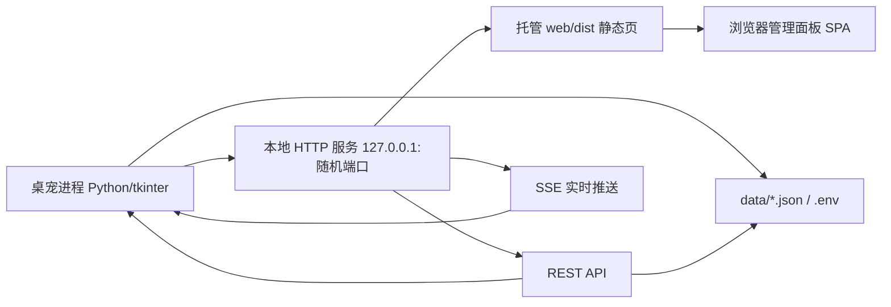

# 小栗帽桌宠 · 浏览器管理面板（方案文档）

> 状态：已确认 · 执行中（阶段 0） · 更新：2026-08-05
> 运行约定：所有 Python 操作在 `.venv` 虚拟环境中执行（`.venv\Scripts\python.exe`）

## 0. 决策记录

| # | 决策 | 结论 |
|---|------|------|
| 1 | 页面形态 | 纯前端网页（浏览器打开），桌宠启动后**不自动弹窗**，右键菜单手动打开 |
| 2 | 技术栈 | Vite + TypeScript + 原生 CSS + GSAP，**零 UI 框架**，手写 hash 路由 + 手写 store |
| 3 | 后端 | Python 标准库起步（http.server），不预装依赖，需要时再引入 |
| 4 | 操控权限 | 管理页允许**重启 / 退出**桌宠本体 |
| 5 | 提醒功能 | reminder 是 AI 技能（skills/schedule），**不做独立提醒模块**；技能管理做详细设置 |
| 6 | 运行环境 | 所有 Python 操作在 `.venv` 虚拟环境中执行 |
| 7 | 主题 | 继承 `core/config.py` 配色常量 |

## 1. 现有功能盘点（代码核实）

### 1.1 当前右键菜单（完整结构）

| 层级 | 菜单项 | 功能 |
|------|--------|------|
| 顶层 | 💬 对话 | 弹出输入条，AI/预设闲聊 |
| 顶层 | 🍙 喂饭团 | 饱腹+30 / 活力+5，随机台词 |
| 记录▼ | 📊 查看状态 | 切换桌宠下方状态条 |
| 记录▼ | 📋 聊天记录 | 查看（可搜索，最近 200 条） |
| 记录▼ | 🗑 清空记录 | 清空聊天记录 |
| 设置▼ | 📏 调整大小 | 宠物缩放 0.5–2.0 + 预览 |
| 设置▼ | ⚡ 技能管理 | 技能列表/启用/删除/添加（.py/.zip） |
| 设置▼ | 🔑 API 设置 | 供应商 + 模型 + Key + 测试连接 |
| 设置▼ | 🔤 字体设置 | 中文字体族 + 字号 8–24 + 预览 |
| 设置▼ | ⚙ 系统设置 | AI/预设闲聊间隔、记忆轮数、恢复默认 |
| 小游戏▼ | 🎮 游戏管理 | 5 个游戏启用开关 |
| 小游戏▼ | 已启用游戏名 | 直接启动游戏 |
| 小游戏▼ | ⏹ 退出游戏 | 停止当前游戏 |
| 顶层 | 🔄 重启 | 带 `--restart` 重启进程 |
| 顶层 | 🚪 退出 | 告别语 + 运行统计后退出 |

### 1.2 代码里有、桌宠 UI 没有

- `schedule` 技能（skills/schedule）：完整日程/提醒后端（reminder.py + SKILL.md），桌宠 UI 无提醒管理入口 → 由技能管理页覆盖。

### 1.3 桌宠交互（不进菜单）

- 左键拖拽移动、单击说话、双击弹跳、悬停表情、中键截图 + AI 看图（vision 模型）。

## 2. 右键菜单瘦身

原则：菜单只留「即时互动 + 游戏（必须跑在桌宠身上）」，所有低频配置类搬去管理页。

### 2.1 建议的新菜单

```
⚡ 打开管理面板      ← 新增，置顶
────────────────
💬 对话
🍙 喂饭团
📊 查看状态         ← 保留
────────────────
🎮 小游戏
  ├─ [启用的游戏名…]  ← 保留
  └─ ⏹ 退出游戏       ← 保留
────────────────
🔄 重启
🚪 退出
```

### 2.2 从菜单移除 → 搬去管理页

| 菜单项 | 去向 |
|--------|------|
| 📋 聊天记录 | 聊天页（带搜索） |
| 🗑 清空记录 | 聊天页（二次确认） |
| 📏 调整大小 | 设置页 |
| ⚡ 技能管理 | 技能页（详细设置） |
| 🔑 API 设置 | 设置页 |
| 🔤 字体设置 | 设置页 |
| ⚙ 系统设置 | 设置页 |
| 🎮 游戏管理 | 游戏页 |

## 3. 管理页功能需求

### 3.1 仪表盘（首页）
- 宠物 SVG 形象 + 待机/互动动画（与桌宠视觉同源）
- 饱腹 / 活力双环形进度（实时），低值警告态
- 快捷操作：喂饭团、打开聊天、快速启动一个游戏
- 陪伴统计：累计聊天轮数、本次运行时长
- 技能速览：已启用技能数
- 系统信息角标：CPU / 内存占用（复用 get_system_info）

### 3.2 聊天
- 历史时间线（用户/小栗帽气泡 + 时间戳），关键词搜索，最近 200 条
- 输入框直接对话（走桌宠同一 AI 客户端，保留记忆上下文）
- 清空记录（二次确认）、导出 `.txt`（格式对齐现有导出）

### 3.3 游戏
- 5 个游戏卡片（名称+描述+图标）：启用/禁用开关
- 当前游玩状态；启动 / 停止游戏（游戏本体仍在桌宠窗口跑）

### 3.4 技能（详细设置，重点）
- 总览：技能卡片（名称/描述/启用状态/目录/加载状态），导入（.py/.zip）、刷新、删除（二次确认）
- 详情（点进每个技能）：
  - 元信息：name、description、目录、是否有 execute
  - 参数表：名称/类型/必填/说明（与喂给 AI 的 function schema 一致，来自 get_tools()）
  - SKILL.md 原文查看（只读优先）
  - 手动执行测试：按参数表生成表单/JSON → 调用 execute → 展示返回结果
- 内置技能：schedule（日程/提醒）、get_weather（天气）

### 3.5 设置
- API：供应商、模型（联动）、Key（掩码+切换）、测试连接、保存即生效
- 宠物外观：大小滑块 0.5–2.0（实时预览）
- 字体：字号 8–24、字体族候选（含预览）
- 系统：AI 最短/最长间隔、预设间隔、记忆轮数、恢复默认
- 进程控制：重启、退出（已确认允许）

## 4. 架构



- 仅绑 127.0.0.1；每次启动生成随机 token（URL 参数），页面存 sessionStorage 后请求携带
- 桌宠退出/重启时优雅关闭服务；token 每次启动变化 → 重启后旧页面失效，需重新右键打开（安全取舍）

## 5. 技术栈

| 层 | 选择 |
|----|------|
| 构建 | Vite |
| 语言 | TypeScript（strict） |
| UI 框架 | 无（手写组件/路由/store） |
| 样式 | 原生 CSS + tokens 变量 |
| 动画 | GSAP（唯一运行时库） |
| 图标 | 内联 SVG |
| 后端 | Python 标准库 http.server + 自写 REST/SSE |

## 6. 接口设计（设计层，不写实现）

- 状态：GET /api/status；SSE /api/events（饱腹/活力/游戏/技能变化）
- 聊天：GET /api/history（?q= 搜索）、POST /api/chat、DELETE /api/history、GET /api/history/export
- 游戏：GET /api/games、POST /api/games/{key}/toggle、POST /api/games/{key}/start|stop
- 技能：GET /api/skills、GET /api/skills/{name}（详情+SKILL.md）、POST /api/skills/{name}/toggle、POST /api/skills/{name}/execute、DELETE /api/skills/{name}、POST /api/skills/import
- 设置：GET/POST /api/settings、POST /api/settings/api（含测试连接）、POST /api/pet/feed、POST /api/pet/size、POST /api/pet/restart、POST /api/pet/quit

## 7. 目录结构

```
web/                          # 前端工程（Vite）
  index.html
  src/
    main.ts
    styles/  tokens.css  base.css
    router.ts  store.ts
    api/      client.ts  types.ts
    components/  PetAvatar  StatusRing  GlassCard  ...
    views/  Dashboard  Chat  Games  Skills  Settings
core/web_server.py            # 本地服务 + REST/SSE + token
ui/pet_window.py              # 右键菜单瘦身 + 「打开管理面板」
```

## 8. 分阶段计划

| 阶段 | 内容 | 验收 | 预估 tokens |
|------|------|------|-------------|
| 0 落档+初始化 | 本文档 + web/ Vite+TS+GSAP 空壳 + 主题 tokens | npm run build 通过 | 10k–20k |
| 1 骨架+仪表盘静态 | 布局/路由/store + 仪表盘（mock 数据）+ 4 页占位 | 浏览器可见完整布局，5 页可切换；commit ① | 40k–70k |
| 2 后端+实时 | core/web_server.py（REST+SSE+token）+ 前端实连 | 真实状态实时变化，喂饭团生效；commit ② | 80k–140k |
| 3 聊天+设置 | 聊天页 + 设置页（API/大小/字体/间隔/重启退出） | 网页可对话/看历史/改 API/重启退出生效；commit ③ | 80k–130k |
| 4 游戏+技能 | 游戏页 + 技能详细设置页 + 后端补 2 API | 游戏开关/启停、技能参数/测试/导入删除可用；commit ④ | 100k–170k |
| 5 桌宠侧改造 | 菜单瘦身 + 打开入口 + token + 服务生命周期 | 右键打开、旧菜单消失、重启/退出正常；commit ⑤ | 40k–70k |
| 6 打磨+打包 | GSAP 调优、响应式、断线重连、全流程验证 | 效果满意、无阻塞 bug；commit ⑥ | 60k–120k |

执行约定：每阶段结束 commit + 开新线程继续（省 token）。

## 9. 开放点 / 后续可议

- 技能 SKILL.md 是否支持网页编辑（默认只读）
- token 是否落盘以便重启后旧页面自动恢复（默认不落盘）
- 对话输入条 / 查看状态是否保留在桌宠菜单（默认保留）